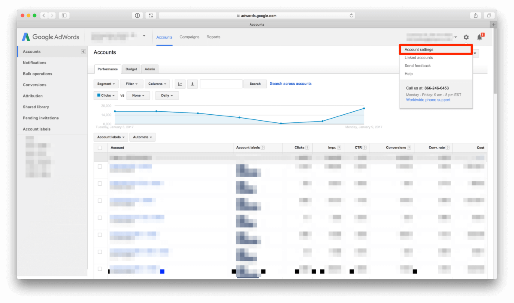
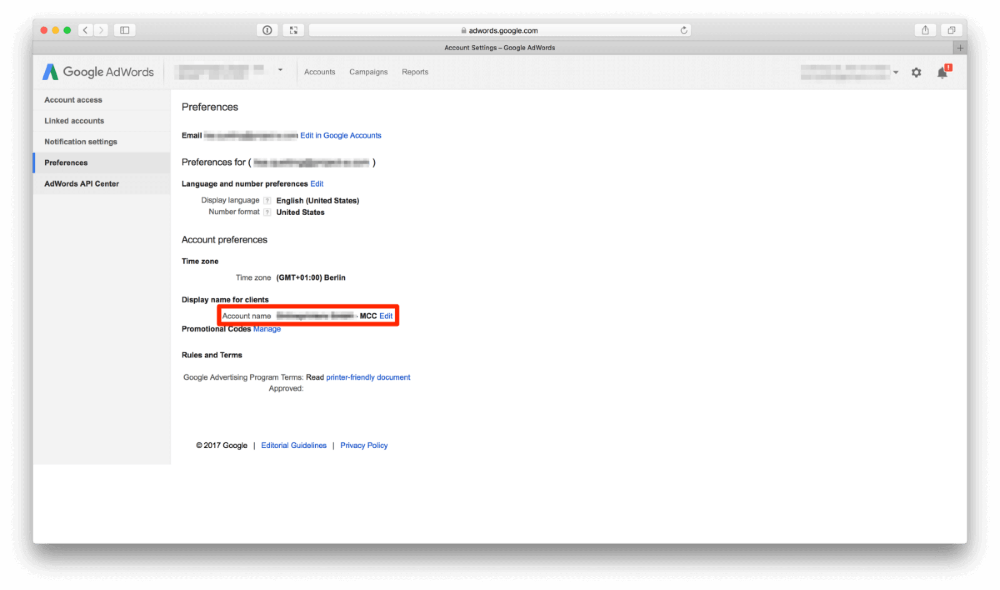
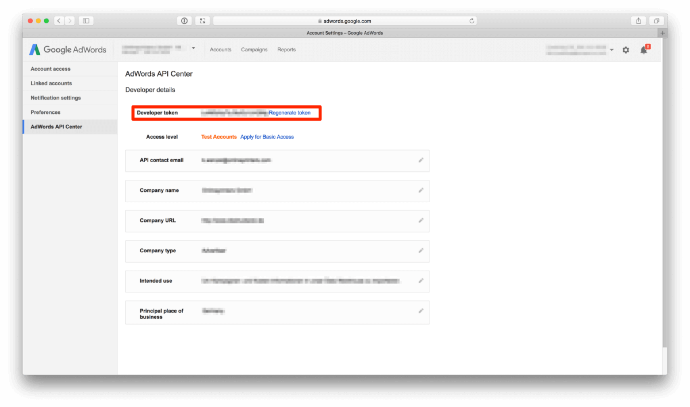
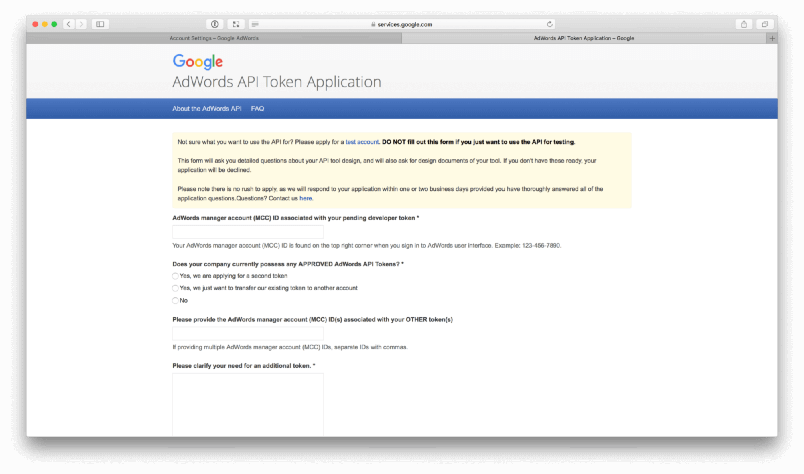
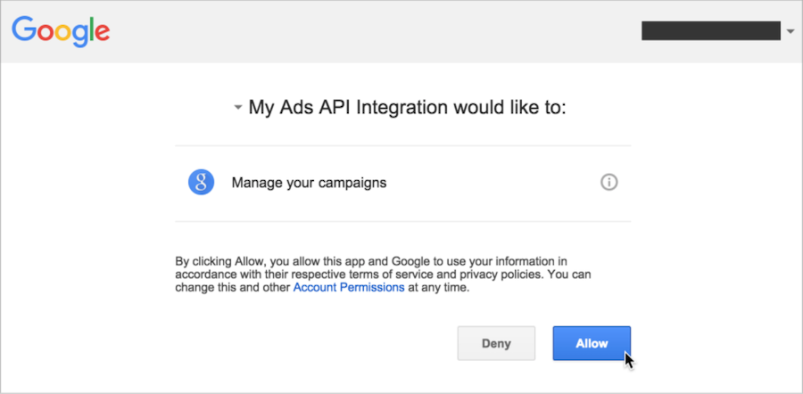
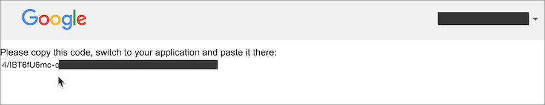

# Google AdWords Performance Downloader

A Python script for downloading performance data and account structure from an [MCC account](https://adwords.google.com/home/tools/manager-accounts/) using the Google Adwords API ([v201702](https://developers.google.com/adwords/api/docs/reference/#v201702)) to local files. 

## Resulting data
By default, it creates two data sets:

1. **Ad Performance** consists of measures such as impressions, clicks, conversions and cost. The script creates one file per day in a specified time range:

        data/2015/03/31/adwords/ad-performance-v1.json.gz
        data/2015/04/01/adwords/ad-performance-v1.json.gz

    For the last 30 days, the script always re-downloads the files as data still changes (e.g cost or attributed conversions). Beyond that, files are only downloaded when they do not yet exist. 
    **Note**: If you are using an attribution window larger than 30 days adjust the `redownload_window` config accordingly.

    The resulting JSON files contain arrays of dictionaries per ad, device and network: 
  
        [
          {
            "Day": "2015-03-31",
            "Ad ID": "69450572293",
            "Device": "Computers",
            "Network (with search partners)": "Google search",
            "Active View viewable impressions": "0",
            "Avg. position": "1.0",
            "Clicks": "1",
            "Conversions": "0.0",
            "Total conv. value": "0.0",
            "Converted clicks": "0",
            "Cost": "590000",
            "Impressions": "4"
          },
          ..
        ]
    
    See [Ad Performance Report](https://developers.google.com/adwords/api/docs/appendix/reports/ad-performance-report) for a documentation of the fields.

2. **Account Structure** information. This file is always overwritten by the script:

        data/adwords-account-structure-v1.csv.gz

    Each line contains one ad together with its ad group, campaign and account:

        ad_id         | 69450572293
        ad_name       | Online Veiling Gent
        ad_group_id   | 17837800573
        ad_group_name | Veiling Gent
        campaign_id   | 254776453
        campaign_name | BE_NL_GEN_Auction_City_{e}
        account_id    | 3470519330
        account_name  | BE_Dutch_Search
        attributes    | {"Target": "buyer", "Ad type": "Text ad", "Channel": "SEM", "Country": "Belgium", "Ad state": "disabled", "Language": "Dutch"}

    The `attributes` field contains a JSON representation of all [labels](https://support.google.com/adwords/answer/2475865) of an ad or its parents in a `{Key=Value}` syntax. For example, if an account has the label `{Channel=SEM}`, then all ads below will have the attribute `"Channel": "SEM"`. 
    **Note**: Labels on lower levels overwrite those from higher levels.

## Getting Started

### Prerequisites

To use the Google AdWords Performance Downloader you have to

- consolidate all accounts of a company under a single [manager account](https://adwords.google.com/home/tools/manager-accounts/) (aka. MCC), 
- not delete any ad, ad group, campaign or account (but disable them instead) so that you can relate past performances to structure data,
- set up Oauth2 credentials to access the Google Adwords API. See [Set up your OAuth2 credentials](#set-up-your-oauth2-credentials) for the necessary steps.

Optionally, you can apply labels on all hierarchy levels for segmenting the structure.

### Installation

 The Google AdWords Performance Downloader requires:

    Python (>= 3.5)
    googleads (==5.2.0)
    click (>=6.0)

The easiest way to install google-adwords-downloader is using pip

    pip install git+https://github.com/mara/google-adwords-performance-downloader.git

In case you want to install it in a virtual environment:

    $ git clone git@github.com:mara/google-adwords-performance-downloader.git adwords_downloader
    $ cd adwords_downloader
    $ python3 -m venv .venv
    $ .venv/bin/pip install .

### Set up your OAuth2 credentials

**Note: Should you not be able to see the images, please deactivate your adblocker** 

Create an `oauth2_client_id` and `oauth2_client_secret`. As described in [Google AdWords documentation](https://developers.google.com/adwords/api/docs/guides/authentication#installed). 

Log into your Google Adwords account and go to account settings:

In the account settings you find the `client_customer_id` (account name aka MCC):

Fill out the developer details in the Adwords API Center. This page also provides you with the `developer_token`:  

To get access level beyond the test account fill out the Adwords API Token application:

Once approved, use the Google Adwords API to get an OAuth2 refresh token by calling (replace with your credentials):

    $ refresh-adwords-api-oauth2-token --client_customer_id 123-456-7890 \
    --developer_token ABCDEFEGHIJKL \
    --oauth2_client_id 123456789-abcdefghijklmnopqrstuvwxyz.apps.googleusercontent.com \
    --oauth2_client_secret aBcDeFg 

This prompts you to visit a URL where you need to allow the OAuth2 credentials to access the API on your behalf. Navigate to the URL in a private browser session or an incognito window. Log in with the same Google account you use to access AdWords, and then click **Allow** on the OAuth2 consent screen:

An authorization code is shown to you. Copy and paste it into the command line where you are running the `adwords-downloader-refresh-oauth2-token` and press enter. The script should complete and display an offline `oauth2_refresh_token`:

## Usage

To run the Google AdWords Performance Downloader call `download-adwords-performance-data` with its config parameters:  

    $ download-adwords-performance-data --client_customer_id 123-456-7890 \
    --developer_token ABCDEFEGHIJKL \
    --oauth2_client_id 123456789-abcdefghijklmnopqrstuvwxyz.apps.googleusercontent.com \
    --oauth2_client_secret aBcDeFg \
    --oauth2_refresh_token 1/acbd-efghijklmnopqrstuvwxyz \
    --data_dir /tmp/adwords
